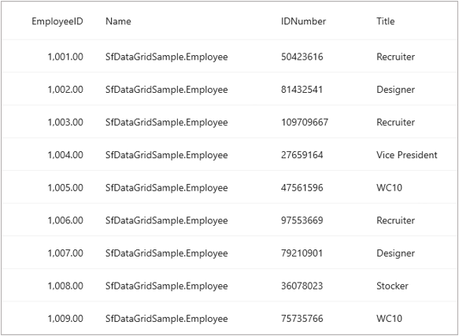

# How to pass the whole data object for the grid line to a converter
By default, SfDataGrid passes the value associated with the property in a DisplayBinding.Converter. In order to, pass the whole data object to the converter, you need to specify the BindingPath of the DisplayBinding as “.” (dot).

Refer the below code which illustrates setting BindingPath as “.” to pass the entire associated underlying data as a parameter to the Converter.
 
 ```XML
 public class DataGridBehavior : Behavior<SfDataGrid>
{
    protected override void OnAttachedTo(SfDataGrid dataGrid)
    {
        dataGrid.AutoGeneratingColumn += DataGrid_AutoGeneratingColumn;
        base.OnAttachedTo(dataGrid);
    }

    private void DataGrid_AutoGeneratingColumn(object? sender, DataGridAutoGeneratingColumnEventArgs e)
    {
        if (e.Column.MappingName == "Name")
        {
            e.Column.DisplayBinding = new Binding(".", BindingMode.Default, new ConvertCustomerName());
        }
    }

    protected override void OnDetachingFrom(SfDataGrid dataGrid)
    {
        dataGrid.AutoGeneratingColumn -= DataGrid_AutoGeneratingColumn;
        base.OnDetachingFrom(dataGrid);
    }
} 
 ```
 
The following code gives the implementation of the converter to get the data object.
 
 ```XML
 public class ConvertCustomerName : IValueConverter
{
    public object? Convert(object? value, Type targetType, object? parameter, CultureInfo culture)
    {
        if (value != null)
        {
            return (value).ToString();
        }
        return null;
    }
    public object ConvertBack(object? value, Type targetType, object? parameter, CultureInfo culture)
    {
        throw new NotImplementedException();
    }
}
 ```
 
On executing the above code, you will get the output as shown below:
 
 

[View sample in GitHub](https://github.com/SyncfusionExamples/How-to-pass-the-whole-data-object-for-the-grid-line-to-a-converter)
 
Take a moment to explore this [documentation](https://help.syncfusion.com/maui/datagrid/overview), where you can find more information about Syncfusion .NET MAUI DataGrid (SfDataGrid) with code examples. Please refer to this [link](https://www.syncfusion.com/maui-controls/maui-datagrid) to learn about the essential features of Syncfusion .NET MAUI DataGrid (SfDataGrid).
 
##### Conclusion
 
I hope you enjoyed learning about how to pass the whole data object (for the grid line) to a converter.
 
You can refer to our [.NET MAUI DataGrid’s feature tour](https://www.syncfusion.com/maui-controls/maui-datagrid) page to learn about its other groundbreaking feature representations. You can also explore our [.NET MAUI DataGrid Documentation](https://help.syncfusion.com/maui/datagrid/getting-started) to understand how to present and manipulate data. 
For current customers, you can check out our .NET MAUI components on the [License and Downloads](https://www.syncfusion.com/sales/teamlicense) page. If you are new to Syncfusion, you can try our 30-day [free trial](https://www.syncfusion.com/downloads/maui) to explore our .NET MAUI DataGrid and other .NET MAUI components.
 
If you have any queries or require clarifications, please let us know in the comments below. You can also contact us through our [support forums](https://www.syncfusion.com/forums), [Direct-Trac](https://support.syncfusion.com/create) or [feedback portal](https://www.syncfusion.com/feedback/maui?control=sfdatagrid), or the feedback portal. We are always happy to assist you!
